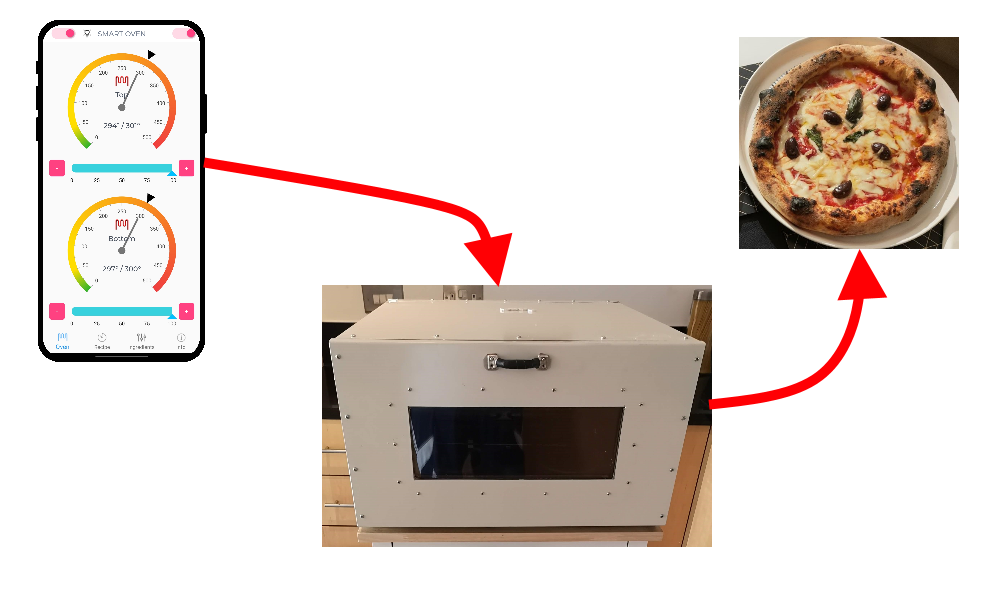
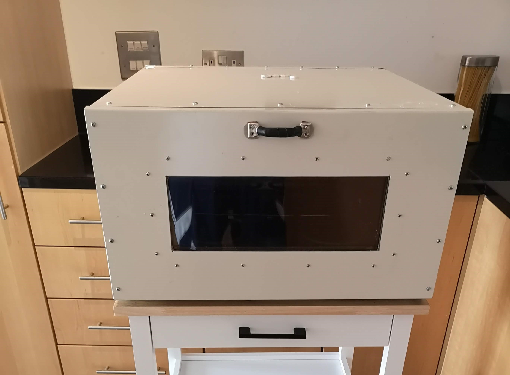
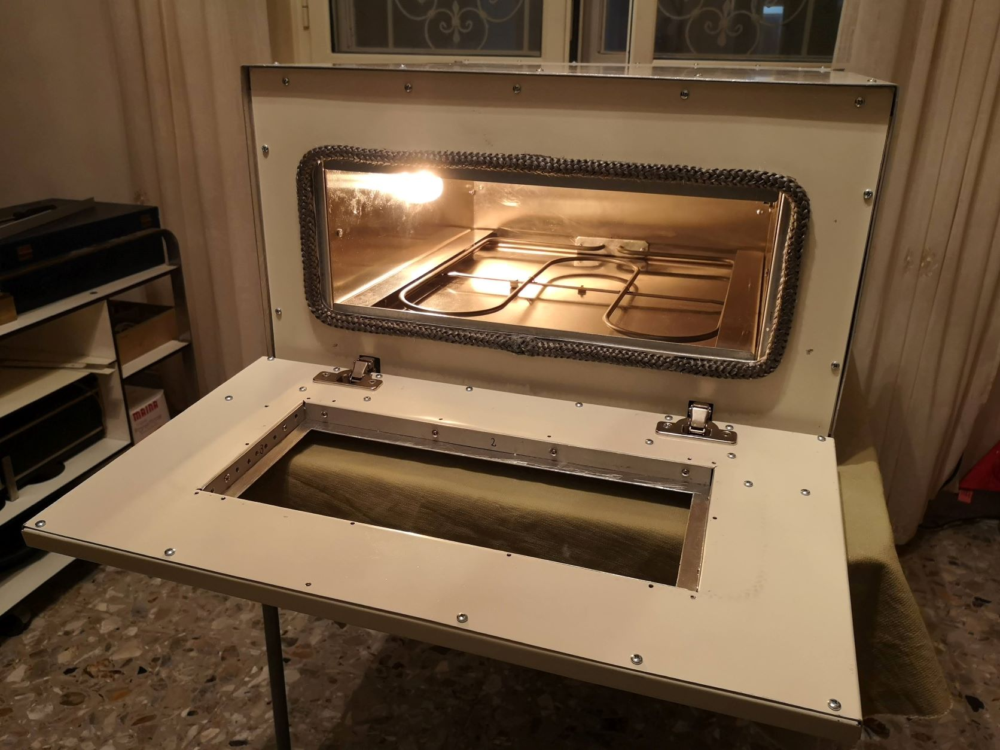
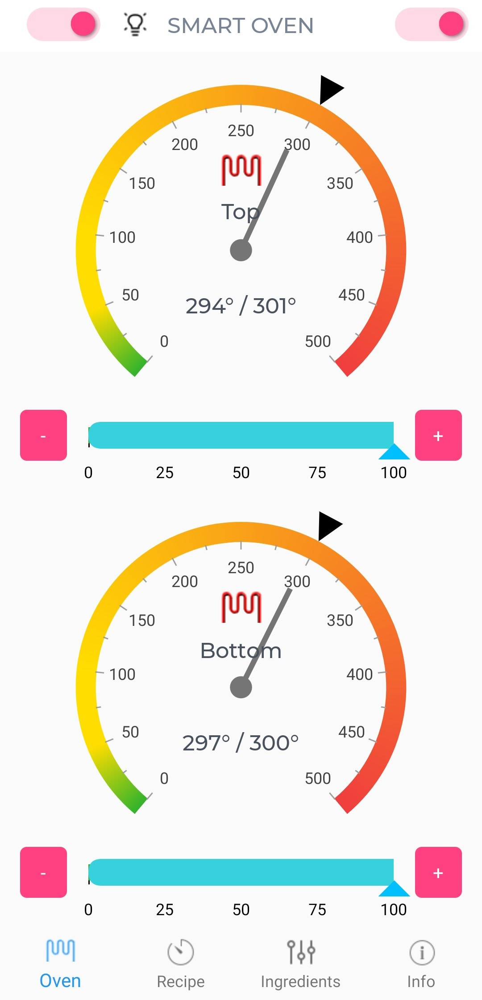
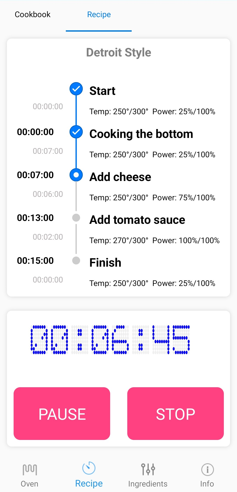

# SmartOven

Smart Oven is an oven that has no controls on its panel, all settings are managed through the SmartOven mobile app. The Smart Oven can reach temperatures of 500° Celsius (932° Fahrenheit) to cook Neapolitan pizza, or you can decide to cook roman tray pizza at lower temperatures/

  

# The Project

The project has 2 modules:

- the app: is a Xamarin app that get all the information regarding temperature, recipe, etc... from the ESP32 via Bluetooth. Also the app is able to send command to the Oven like switch on, off, set temperature, etc..
- the oven: the oven has an electronic that communicate with the app which is written using the ArduinoSDK for an ESP32 board that controls the oven.

  
  
  
  
  

# How SmartOven works

Smart Oven is a classic oven with two heating elements, one on the top and one on the bottom. The difference from a standard oven is that the two elements are not controlled by a classic thermostat with ugly knobs. Instead, in the Smart Oven, there is a tiny electronic module that include an ESP32 board and few others modules and sensors that control the Oven. The electronic constantly communicate with an app on your phone or tablet to transfer the information related to the current temprature measured by the sensors, and receive commands from the app to increase or decrease the desired temperature.

# The App

The app is developed using Xamarin and Syncfusion UI components. In order to build the project open the subfolder app/ with Visual Studio with Xamarin core installed.
The app communicate using Bluetooth Low Energy with the ESP32, is using a very simple protocol to read the sensor temperatures from the ESP32 and to send commands. I've tested the app on Android, never compiled for IOS.

# The Ovem: the Firmware

The firmware for the ESP32 is written using the arduino libraries. You will find the firmware in the firmware/ subfolder of this repository. In order to compile it you need to open the project using a Visual Studio Code with the Platform IO extension installed.
The ESP32 module communicate with two sensors to get the current top and bottom temperature and two dimmers to switch the elements on and off (with also the possibility to partialize the power from 0% to 100% in order to have a more smooth cooking)

# The Oven: the hardware

The oven has an internal chamber made of stainless steel, inside this chamber there are 2 heating elements, one on the topof 1900 Watts and one on the bottom of 800 Watts. On top of the bottom element there is a pizza stone. The door has a double ceramic glass. The outside is made of an alluminuom case.

ss
